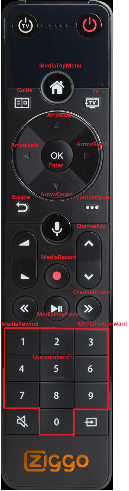

<!-- # LG Horizon Settop boxes (Ziggo, Telenet, Magenta, UPC, Virgin) -->

# LG Horizon Settop boxes for Ziggo(NL), Magenta(AT), UPC(CH, PL), Virgin(GB, IE), Telenet(BE)

[](https://github.com/hacs/integration)
<br><a href="https://www.buymeacoffee.com/sholofly" target="_blank"></a>

## WARNING: This component replaces the Arris DCX960 component and is in beta status

## Description

A media player component for Home Assistant that controls each LG Horizon Settopbox in your account. After configuration you should see:

- one media player entity for each physical device in your account.
- one sensor entity with the used recording capacity, only if recording is enabled
- Media browser enabled for recordings
- Extended logging

## Supported countries and providers

| Country       | Provider        | Box name                                                                                                                                                     | Confirmed working |
| ------------- | --------------- | ------------------------------------------------------------------------------------------------------------------------------------------------------------ | ----------------- |
| Netherlands   | Ziggo           | [Mediabox Next](https://www.ziggo.nl/televisie/mediaboxen/mediabox-next#ziggo-tv), [Mediabox Next mini](https://www.ziggo.nl/televisie/mediaboxen/next-mini) | yes               |
| Austria       | Magenta         | [Entertain box 4K](https://www.magenta.at/entertain-box)                                                                                                     | yes               |
| Switzerland   | UPC Switzerland | [UPC TV Box](https://www.upc.ch/en/television/learn-about-tv/tv/)                                                                                            | yes               |
| Ireland       | Virgin Media    | [360 box](https://www.virginmedia.ie/virgintv360support/)                                                                                                    | yes               |
| Belgium       | Telenet         | [Telenet TV-Box](https://www2.telenet.be/nl/klantenservice/ontdek-de-telenet-tv-box/)                                                                        | yes               |
| Great Britain | Virgin Media    | [Virgin TV 360](https://www.virginmedia.com/shop/tv/virgin-tv-360)                                                                                           | yes               |
| Poland        | UPC Poland      | [UPC TV Box](https://www.upc.pl/telewizja/poznaj/poznaj-nasza-telewizje/dekoder-4k/)                                                                         | yes               |

## Prerequisites

- The energy mode needs to be set to high, otherwise you are not able to switch the device on in the media player.

## HACS Installation

1. Make sure you've installed [HACS](https://hacs.xyz/docs/installation/prerequisites)
2. In the integrations tab, search for LG Horizon.
3. Install the Integration. Please consider enabling beta versions to keep track of the latest (experimental) features.
4. Configure the integration using the HA integration page, Search for LG Horizon.

## Manual installation

1. Open the directory (folder) for your HA configuration (where you find configuration.yaml).
2. If you do not have a custom_components directory (folder) there, you need to create it.
3. In the custom_components directory (folder) create a new folder called lghorizon.
4. Download all the files from the custom_components/lghorizon/ directory (folder) in this repository.
5. Place the files you downloaded in the new directory (folder) you created.
6. Restart Home Assistant
7. Configure the integration using the HA integration page, Search for LG Horizon.

## Configuration (Example!)

1. In HA Click on settings
2. Click on Integrations
3. Click on button 'Add integration'
4. Search for 'LG Horizon' and click

### Parameters

| Parameter  | Required              | Description                         |
| ---------- | --------------------- | ----------------------------------- |
| Username   | yes                   | Your provider username              |
| Password   | yes                   | Your provider password              |
| Provider   | yes (default 'Ziggo') | Your Provider                       |
| Identifier | no (only for Telenet) | Your account identifier (see below) |

## Configuration Telenet multiple accounts

When you can't connect to your Telenet account it's possible that you have multiple accounts and you have to provide your account identifier.
You can find your identifier by opening your browser in incognito mode and login to your telenet TV environment.
After entering your credentials an account selection screen will popup:


- Find the account with the option 'Digital Base Telenet TV2'
- Right click the radio button before that account and click inspect element
- In the source code find the value of the box. Usually starts with DTV
  
- Use that code in the config of your telenet account in HA

## Service to change channel

```yaml
service: media_player.play_media
data:
  media_content_type: channel # 'channel' when media_content_id is channelnumber, 'app' when media_content_id is 'Netflix' or 'Videoland'
  media_content_id: "401" # Any channel number, 'Netflix' or 'Videoland'
target:
  entity_id: media_player.ziggo_beneden
```

## Custom services

This service can be called to start a recording. Note that this shows a pop-up on screen and confirmation is required.

```yaml
service: lghorizon.record
data:
  entity_id: media_player.ziggo_beneden
```

This service can be called to rewind or fast-forward.
Note that this command can be called multiple times to speed up.
To stop this action, you can call the standard media_player.play service on the same entity.

```yaml
service: lghorizon.rewind
data:
  entity_id: media_player.ziggo_beneden

service: lghorizon.fast_forward
data:
  entity_id: media_player.ziggo_beneden
```

This service can be called to emulate a key press on the remote control.

```yaml
service: lghorizon.remote_key_press
data:
  entity_id: media_player.ziggo_beneden
  remote_key: "MediaTopMenu"
```



## Disclaimer

This component is not provided, supported or maintained by any of the companies named above. They can change their hardware, software or web services at a way that can break this component. Fingers crossed!

## Credits

- The excellent start from [IIStevowII](https://github.com/IIStevowII/ziggo-mediabox-next) for a single settopbox inspired me!
- The nodejs script [NextRemoteJs from basst85](https://github.com/basst85/NextRemoteJs/) used as reference to compare results.
- The input from [Jochen Siegenthaler](https://github.com/jsiegenthaler/). His [Homebridge](https://github.com/jsiegenthaler/homebridge-eosstb) development helped me forward.
- Contributions on this project and the lghorizon-api package by:
  - [shortwood](https://github.com/shortwood)
  - [michael-geerts](https://github.com/michael-geerts)
  - [caraar12345](https://github.com/caraar12345)
  - [pejeio](https://github.com/pejeio)
  - [dynasticorpheus](https://github.com/dynasticorpheus)
- Testing by:
  - Craig McGowan (GB)
  - Jarne Roussard (BE)
  - Sammy Verdonck (BE)
  - Jordi Smolders (BE)
  - [Majkel Łacina (PL)](https://github.com/lacinamichal)
