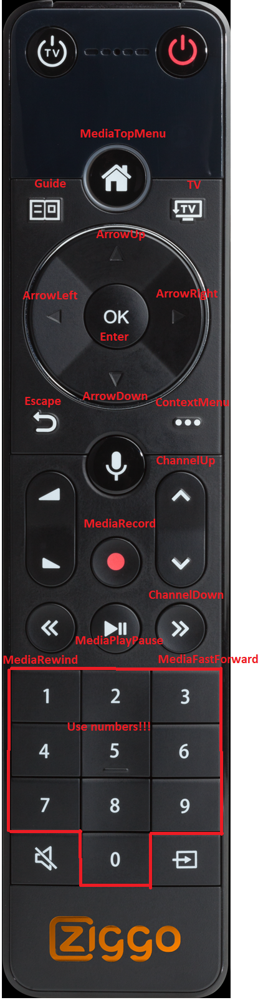

<!-- # LG Horizon Settop boxes (Ziggo, Telenet, Magenta, UPC, Virgin) -->

# LG Horizon Settop boxes for Ziggo(NL), Telenet(BE), Virgin(GB, IE), Sunrise(CH)

[](https://github.com/hacs/integration)
<br><a href="https://www.buymeacoffee.com/sholofly" target="_blank"></a>

## Description

A media player component for Home Assistant that controls each LG Horizon Settopbox in your account. After configuration you should see:

- one media player entity for each physical device in your account.
- one sensor entity with the used recording capacity, only if recording is enabled
- Media browser enabled for recordings
- Extended logging

## Supported countries and providers

| Country       | Provider     | Box name                                                                                                                                                     | Confirmed working                                                                                           |
| ------------- | ------------ | ------------------------------------------------------------------------------------------------------------------------------------------------------------ | ----------------------------------------------------------------------------------------------------------- |
| Netherlands   | Ziggo        | [Mediabox Next](https://www.ziggo.nl/televisie/mediaboxen/mediabox-next#ziggo-tv), [Mediabox Next mini](https://www.ziggo.nl/televisie/mediaboxen/next-mini) | yes                                                                                                         |
| Switzerland   | Sunrise      | [Sunrise (IP)TV Box](https://www.sunrise.ch/en/internet-tv/tv-comparison/)                                                                                   | yes (For Sunrise users, use Mobile number as username. For former UPC users, use e-mailaddress as username) |
| Ireland       | Virgin Media | [360 box](https://www.virginmedia.ie/virgintv360support/)                                                                                                    | yes                                                                                                         |
| Belgium       | Telenet      | [Telenet TV-Box](https://www2.telenet.be/nl/klantenservice/ontdek-de-telenet-tv-box/)                                                                        | yes                                                                                                         |
| Great Britain | Virgin Media | [Virgin TV 360](https://www.virginmedia.com/shop/tv/virgin-tv-360)                                                                                           | yes                                                                                                         |

## Prerequisites

- The energy mode needs to be set to high, otherwise you are not able to switch the device on in the media player.

## HACS Installation

1. Make sure you've installed [HACS](https://hacs.xyz/docs/installation/prerequisites).
2. In the integrations tab, search for LG Horizon.
3. Install the integration. Please consider enabling beta versions to keep track of the latest (experimental) features.
4. Configure the integration using the HA integration page. Search for 'LG Horizon'.

## Manual installation

1. Open the directory (folder) for your HA configuration (where you find configuration.yaml).
2. If you do not have a `custom_components` directory (folder) there, you need to create it.
3. In the custom_components directory (folder) create a new folder called lghorizon.
4. Download all the files from the custom_components/lghorizon/ directory (folder) in this repository.
5. Place the files you downloaded in the new directory (folder) you created.
6. Restart Home Assistant
7. Configure the integration using the HA integration page. Search for 'LG Horizon'.

## Configuration (Example!)

1. In HA Click on settings
2. Click on Integrations
3. Click on button 'Add integration'
4. Search for 'LG Horizon' and click

### Parameters

| Parameter     | Required   | Description             |
| ------------- | ---------- | ----------------------- |
| Username      | yes        | Your provider username  |
| Password      | yes        | Your provider password  |
| Provider      | yes        | Your Provider           |
| Refresh Token | not for NL | A JWT Token (see below) |

## Fetching your refresh token

For integrations other than Ziggo a password is not used, instead, you need to supply a refresh token so the integration can retrieve an access token to communicate with your provider. To get the refresh token you need to open the developer toolbar in your chromium based browser.

1. Login to your Virgin box using any Chromium based (i.e. Chrome, Edge) as your web browser:

   GB: [https://virgintvgo.virginmedia.com/](https://virgintvgo.virginmedia.com/)
   CH: [https://www.sunrisetv.ch/](https://www.sunrisetv.ch/)
   BE: [Telenet TV-Box](https://www.telenet.tv/nl/home)

2. Open the 'application' tab in your developer toolbar (open the toolbar with F12)

3. In the left panel navigate to 'local storage' and click on the first line that has the same URL as your page URL starts with

4. On the right side copy the value under: flutter.\_WEB_SECURE_STORAGE_refreshToken

NOTE: The refresh token has an expiry period. For Ziggo it's two weeks. For other providers I just don't know. I expect the same but I'm not sure. The day before expiry a new refresh token will be retrieved automatically! If there's no activity with the access token (i.e you didn't use your box or HA was down for two weeks) within the expiry period, the integration will ask you to re-supply a refresh token.

## Fetching the token using Tampermonkey

[Bert Wynants](https://github.com/berteco3) (thank you!) provided a [TamperMonkey](https://www.tampermonkey.net/) script to retrieve the token in case your provider (i.e. Telenet) disabled the developer tools on their website.

<details>
<summary> The script provided by @berteco3</summary>

```javascript
(function () {
  "use strict";
  const KEY = "flutter._WEB_SECURE_STORAGE_refreshToken";

  function getToken() {
    try {
      return localStorage.getItem(KEY);
    } catch (e) {
      console.error("[TM] localStorage error:", e);
      return null;
    }
  }

  function showConfirm() {
    const token = getToken();
    const msg = token
      ? `flutter._WEB_SECURE_STORAGE_refreshToken:\n\n${token}\n\nPress OK to copy to clipboard`
      : `flutter._WEB_SECURE_STORAGE_refreshToken not found.\n\nPress OK to retry`;

    const ok = confirm(msg);

    if (ok && token) {
      navigator.clipboard
        .writeText(token)
        .then(() => console.log("[TM] Token copied to clipboard"))
        .catch((err) => console.error("[TM] Clipboard error:", err));
    }
  }

  // Delay to allow Flutter apps to finish initializing storage
  setTimeout(showConfirm, 1200);
})();
```

</details>

## Service to change channel

```yaml
service: media_player.play_media
data:
  media_content_type: channel # 'channel' when media_content_id is channelnumber, 'app' when media_content_id is 'Netflix' or 'Videoland'
  media_content_id: "401" # Any channel number, 'Netflix', or 'Videoland'
target:
  entity_id: media_player.ziggo_beneden
```

## Custom services

This service can be called to start a recording. Note that this shows a pop-up on screen and confirmation is required.

```yaml
service: lghorizon.record
data:
  entity_id: media_player.ziggo_beneden
```

This service can be called to rewind or fast-forward.
Note that this command can be called multiple times to speed up.
To stop this action, you can call the standard media_player.play service on the same entity.

```yaml
service: lghorizon.rewind
data:
  entity_id: media_player.ziggo_beneden

service: lghorizon.fast_forward
data:
  entity_id: media_player.ziggo_beneden
```

This service can be called to emulate a key press on the remote control.

```yaml
service: lghorizon.remote_key_press
data:
  entity_id: media_player.ziggo_beneden
  remote_key: "MediaTopMenu"
```



## Having issues?

Please enable debug logging an create an issue on GitHub.
NOTE: Do not just enable debug logging in HA, but also add debug logging for the underlying python component. You can configure it by configuring your logging like this:

```yaml
logger:
  default: warning
  logs:
    lghorizon: debug
```

## Disclaimer

This component is not provided, supported or maintained by any of the companies named above. They can change their hardware, software or web services at a way that can break this component. Fingers crossed!

## Credits

- The excellent start from [IIStevowII](https://github.com/IIStevowII/ziggo-mediabox-next) for a single settopbox inspired me!
- The nodejs script [NextRemoteJs from basst85](https://github.com/basst85/NextRemoteJs/) used as reference to compare results.
- The input from [Jochen Siegenthaler](https://github.com/jsiegenthaler/). His [Homebridge](https://github.com/jsiegenthaler/homebridge-eosstb) development helped me forward.
- [Colin Robbins (UK)](https://github.com/ColinRobbins) did a massive job by researching and implementing the refresh token option. Cheers m8!
- Contributions on this project and the lghorizon-api package by:
  - [shortwood](https://github.com/shortwood)
  - [michael-geerts](https://github.com/michael-geerts)
  - [caraar12345](https://github.com/caraar12345)
  - [pejeio](https://github.com/pejeio)
  - [dynasticorpheus](https://github.com/dynasticorpheus)
  - [Colin Robbins (UK)](https://github.com/ColinRobbins)
- Testing by:
  - Craig McGowan (GB)
  - [Filip Heens (BE)](https://github.com/filip-heens)
  - Jarne Roussard (BE)
  - Sammy Verdonck (BE)
  - Jordi Smolders (BE)
  - [Majkel Łacina (PL)](https://github.com/lacinamichal)
